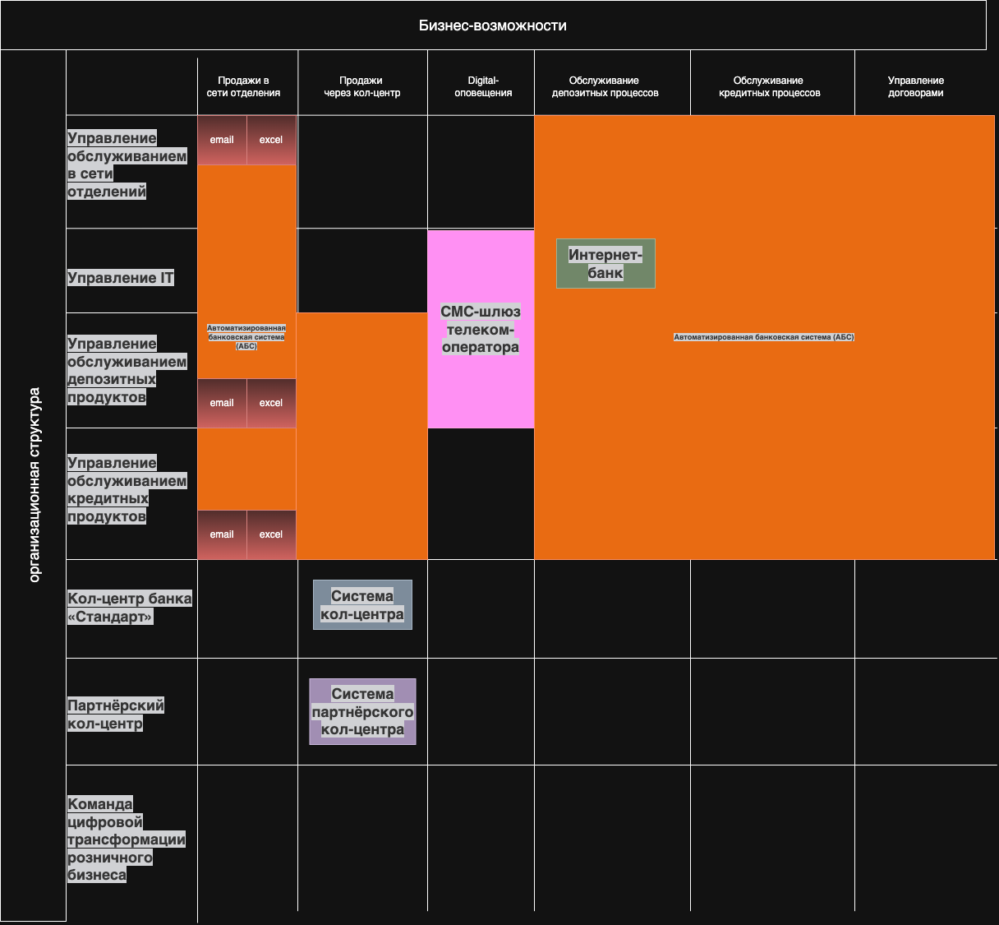
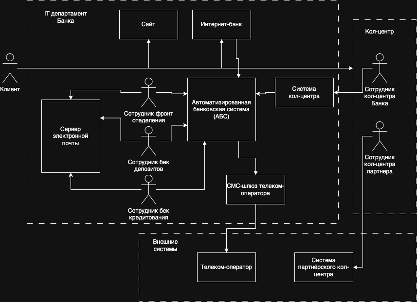

# Architecture Standart #

## Задание 1. Карта IT-ландшафта и схема интеграции приложений ##

[Карта текущего IT-ландшафта Draw.io](Task1/it-landscape.drawio)

[Схема интеграции приложений Draw.io](Task1/integration.drawio)

## Задание 2. FURPS+ таблица ##

[FURSP+](Task2/furspp.md)

## Задание 3. Открытие депозитов онлайн ##

[ADR](Task3/adr-1.md)

### Задание 4. Передача ставок в кол-центр ###

[ADR-2](Task4/adr-2.md)
