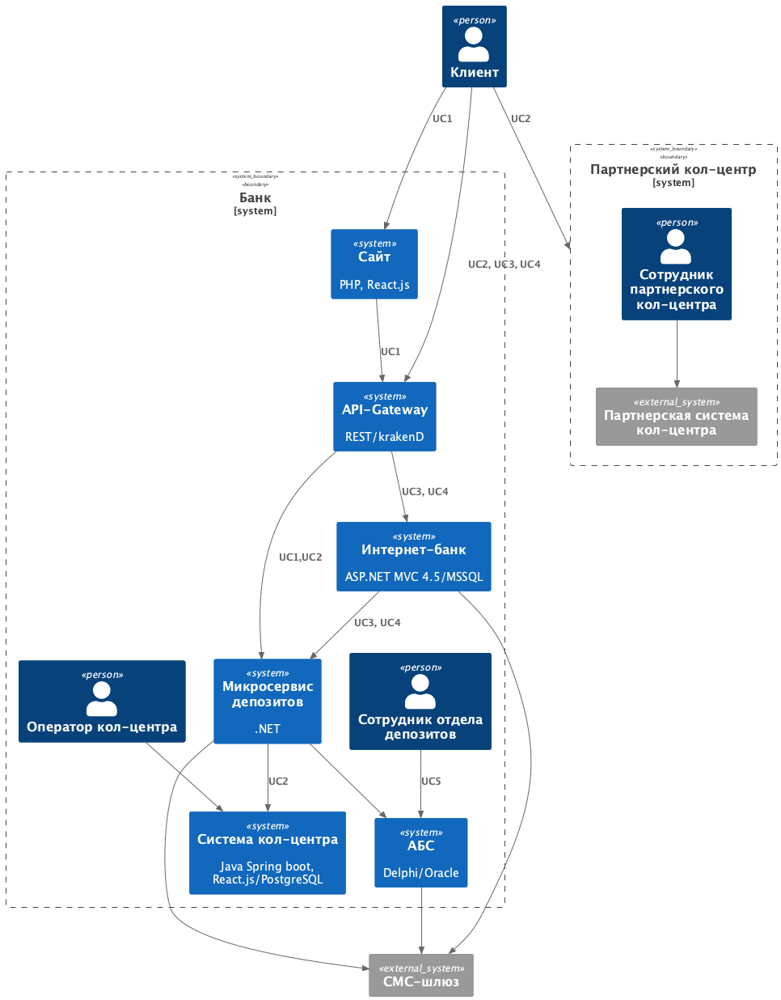
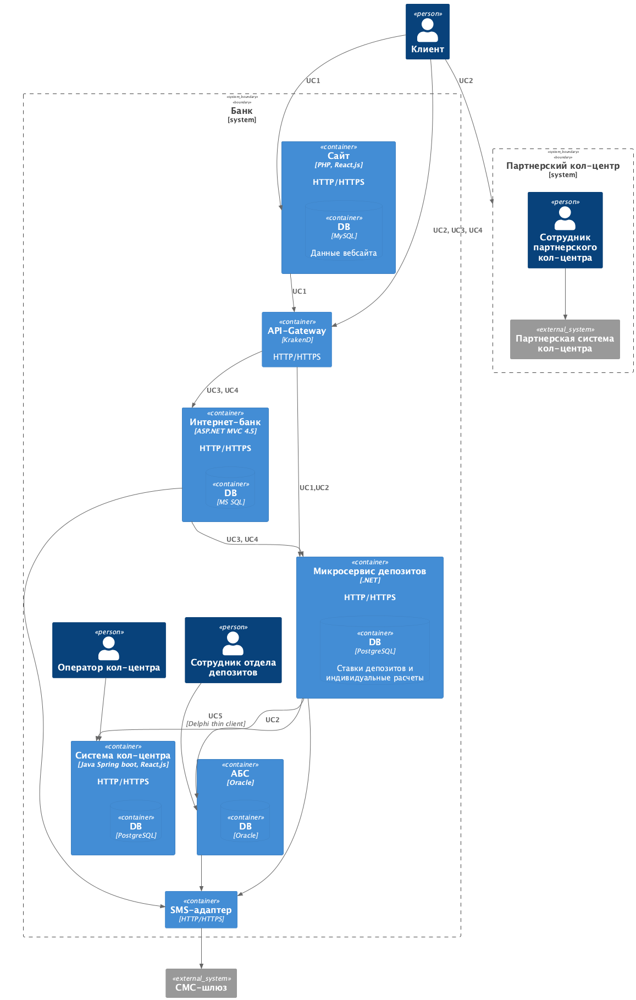

### **Название задачи:** MVP Открытие депозитов онлайн
### **Автор:** Чуханцев В.В.
### **Дата:** 29.05.2025
### **Функциональные требования**
Опишите здесь верхнеуровневые Use Cases. Их нужно оформить в виде таблицы с пошаговым описанием:

| **№** | **Действующие лица или системы** | **Use Case**                                              | **Описание**                                                                                                                                                                                                                                                                |
|:-----:|:---------------------------------|:----------------------------------------------------------|:----------------------------------------------------------------------------------------------------------------------------------------------------------------------------------------------------------------------------------------------------------------------------|
| UC1   | Клиент, Сайт                     | Просмотр доступных депозитов                              | 1. Клиент открывает сайт 2. Сайт подгружает список доступных депозитов 3. Клиент просматривает доступные депозиты                                                                                                                                                           |
| UC2   | Клиент, Сайт, Система кол-центра | Клиент подает заявку на депозит                           | 1. Клиент заполняет форму заявки на депозит на сайте 2. Заявка отправляется в систему кол-центра 3. Заявку можно взять в обработку в системе кол-центра                                                                                                                     |
| UC3   | Клиент, Интернет-банк            | Просмотр списка депозитов с персонализированными ставками | 1. Клиент заходит в Интернет-банк 2. Интернет-банк запрашивает для клиента персонализированные ставки по депозитам 3. Клиент просматривает раздел с персонализированными депозитами                                                                                         |
| UC4   | Клиент, Интернет-банк            | Клиент подает заявку на открытие депозита                 | 1. Клиент выбирает счет для подачи заявки 2. Клиент указывает сумму депозита 3. Клиент отправляет заявку на открытие 4. Интернет-банк отправляет одноразовое СМС с кодом подтверждения 5. Клиент вводит одноразовый код подтверждения из СМС подтверждая тем самым операцию |
| UC5   | Сотрудник бэк-офиса, АБС         | Обработка заявки на открытие депозита                     | 1. Сотрудник заходит в раздел с новыми заявками на открытие депозита в АБС 2. Сотрудник открывает заявку 3. Сотрудник подтверждает условия депозита 4. АБС отправляет смс-оповещение об успешном открытии депозита на оговоренных условиях                                  |
### **Нефункциональные требования**
Опишите здесь нефункциональные требования и архитектурно значимые требования.

| **№** | **Требование**                                                                                                                             |
|:-----:|:-------------------------------------------------------------------------------------------------------------------------------------------|
| R1    | Все сервисы должны быть доступны в 99,9% случаев                                                                                           |
| R2    | Резервирование в разных ЦОД                                                                                                                |
| P1    | Предусмотреть возможность горизонтального и вертикального масштабирования всех компонентов                                                 |
| P2    | Балансирование нагрузки между ЦОД                                                                                                          |
| +R1   | Использование существующих технологий MS SQL, .NET 4.5, ASP.NET MVC 4.5, Oracle, Delphi, React.js, Java, Java Spring Boot, PostgreSQL, PHP |
| +R2   | АБС может масштабироваться только вертикально из-за своей базы данных                                                                      |
| +R3   | Не изменять функционал работы с СМС в ядре системы                                                                                         |
| +R4   | Минимизация прямого взаимодействия с API АБС                                                                                               |
| +R5   | Использование шифрования для передачи чувствительных данных                                                                                |

### **Решение**

[Context C4](context.puml)

[Container C4](container.puml)

1. Использование API Gateway позволит нам балансировать нагрузку между ЦОД, отправлять все запросы в резервный ЦОД в случае аварии или деградации основного ЦОД, разделять запросы к сервису Интернет-банка и новому микросервису депозитов, реализовать шифрование через SSL для формы заявки и в дальнейшем гибко добавлять микросервисы для новых бизнес-процессов банка.

2. Сервисы открытия депозитов реализуем в микросервисной архитектуре, используя хорошо знакомый команде стек .NET. Весь новый функционал открытия депозитов будет взаимодействовать с новым микросервисом, что позволит контролировать нагрузку на АБС, а также не изменять ядро ИБ для работы с СМС-уведомлениями.

3. Контейнерезация позволит нам реагировать на увеличение нагрузки и масштабироваться горизонтально и вертикально.

4. Минимальные изменения в текущих бизнес-процессах банка: новый скрипт у сотрудников кол-центра, новый раздел на сайте банка, новый раздел в интернет-банке, формализация бизнес-процесса утверждения ставок депозитов.

### **Альтернативы**
Опишите здесь наиболее важные альтернативные решения.

| **Альтернативы**                                                  | **Риски**                                                                                                                                              |
|:-----------------------------------------------------------------:|:-------------------------------------------------------------------------------------------------------------------------------------------------------|
| Использовать вместо(вместе с) API Gateway очередь сообщений Kafka | Потребует экспертизы и усложнит реализацию MVP(экономически не целесообразно сейчас, оставлено на будущее когда будет хотя бы несколько микросервисов) |
| Разработка функционала открытия депозита в интернет-банке         | Монолит, тяжёлые релизы, нет горизонтального масштабирования, противоречит требованиям                                                                 |
| Разработка функционала открытия депозита в АБС                    | АБС не позволяет производить горизонтальное масштабирование, противоречит требованиям                                                                  |

**Недостатки, ограничения, риски**

- Потребует внедрение новых технологий: микросервисная архитектура, контейнерезация, CI/CD и т.д.
- Контейнерезация потребует наращивание компетенций DevOps и SRE, дополнительный найм.
- Ручная обработка заявок в MVP: сотрудники могут не справиться при большом количестве обращений, что может негативно повлиять на репутацию банка.
- Необходимо добавить функционал утверждения ставок по депозитам(формализовать бизнес-процесс между отделами вместо excel файла).
- АБС по прежнему не позволяет производить горизонтальное масштабирование: загрузку новых заявок можно будет делать ограниченное число раз в день.
- Потребует дополнительного финансирования: привлечение экспертизы, найм, затраты на оборудование

