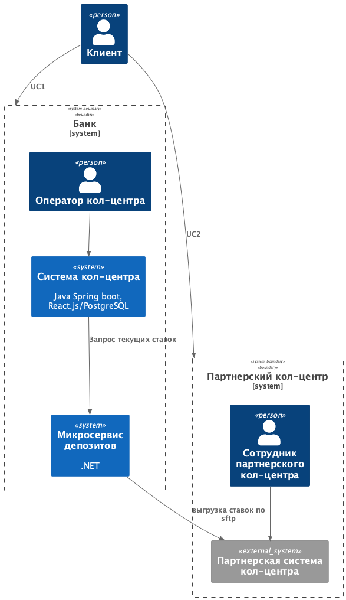
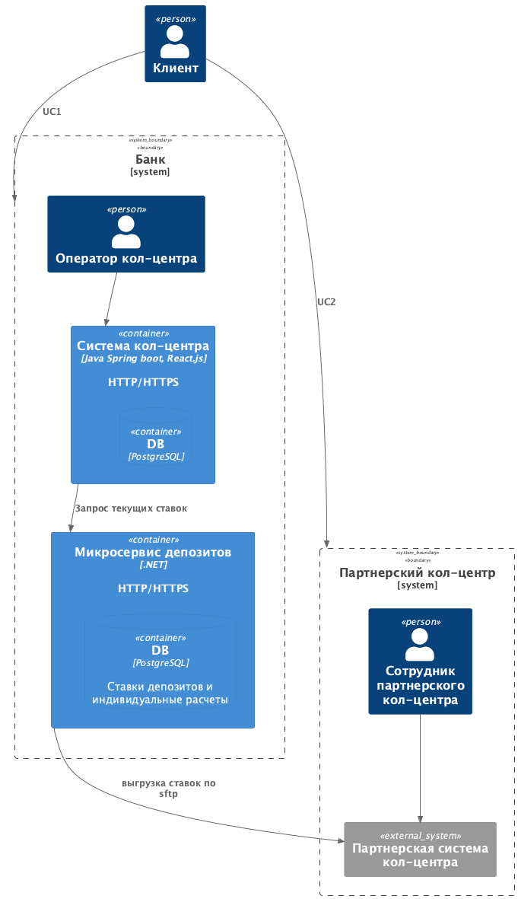
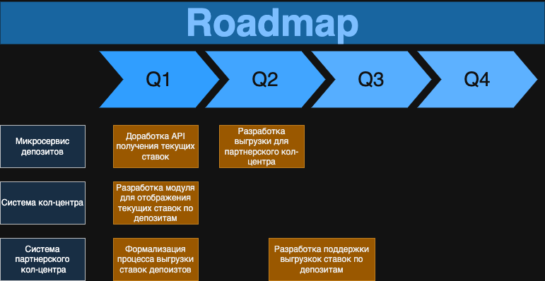

### **Название задачи:** Передача ставок в кол-центр
### **Автор:** Чуханцев В.В.
### **Дата:** 29.05.2025
### **Функциональные требования**
Опишите здесь верхнеуровневые Use Cases. Их нужно оформить в виде таблицы с пошаговым описанием:

| **№** | **Действующие лица или системы**                                           | **Use Case**                      | **Описание**                                                                                                                                                                                                                                                                                                               |
|:-----:|:---------------------------------------------------------------------------|:----------------------------------|:---------------------------------------------------------------------------------------------------------------------------------------------------------------------------------------------------------------------------------------------------------------------------------------------------------------------------|
| UC1   | Клиент, Сотрудник кол-центра банка, Система кол-центра                     | Консультация по текущим депозитам | 1. Клиент звонит на горячую линию 2. Сотрудник кол-центра принимает звонок 3. Сотрудник кол-центра проверяет клиент это банка или нет(необходимо для персонализированных предложений) 4. Сотрудник кол-центра просматривает данные по ставкам депозитов в системе кол-центра 5. Сотрудник кол-центра консультирует клиента |
| UC2   | Клиент, Сотрудник партнерского кол-центра, Система партнерского кол-центра | Консультация по текущим депозитам | 1. Клиент звонит на горячую линию 2. Сотрудник партнерского кол-центра принимает звонок 3. Сотрудник партнерского кол-центра просматривает данные по ставкам депозитов в системе партнерского кол-центра 4. Сотрудник партнерского кол-центра консультирует клиента                                                        |
### **Нефункциональные требования**
Опишите здесь нефункциональные требования и архитектурно значимые требования.

| **№** | **Требование**                                                                                                                         |
|:-----:|:---------------------------------------------------------------------------------------------------------------------------------------|
| +R1   | Кол-центр партнёра работает во внешней информационной системе относительно банка                                                       |
| +R2   | Кол-центр партнёра готовы получать актуальные ставки в виде файлов. Нет возможности сделать API-вызовы (например, через SFTP-протокол) |
### **Решение**

[Context C4](context.puml)

[Container C4](container.puml)

Предполагается что это улучшение после разработки ADR-1 в которой уже есть микросервис депозитов и переиспользовать API получения ставок из интернет-банка.

### **Альтернативы**
Опишите здесь наиболее важные альтернативные решения.

| **Альтернативы**                                     | **Риски**                                     |
|:----------------------------------------------------:|:----------------------------------------------|
| Пересылка депозитов по email в партнерский кол-центр | нет гарантий доставки                         |
| Хранение депозитных ставок в систем кол-центра       | дополнительные проблемы с целостностью данных |

**Недостатки, ограничения, риски**

1. Необходимы доработки: в системе кол-центра, в системе партнерского кол-центра, микросервисе депозитов
2. Может происходить устаревение данных в партнерском кол-центре
3. Нужна будет формализация процесса выгрузки с партнерским кол-центром

### Road Map разработки ###

[Roadmap Draw.io](roadmap.drawio)

